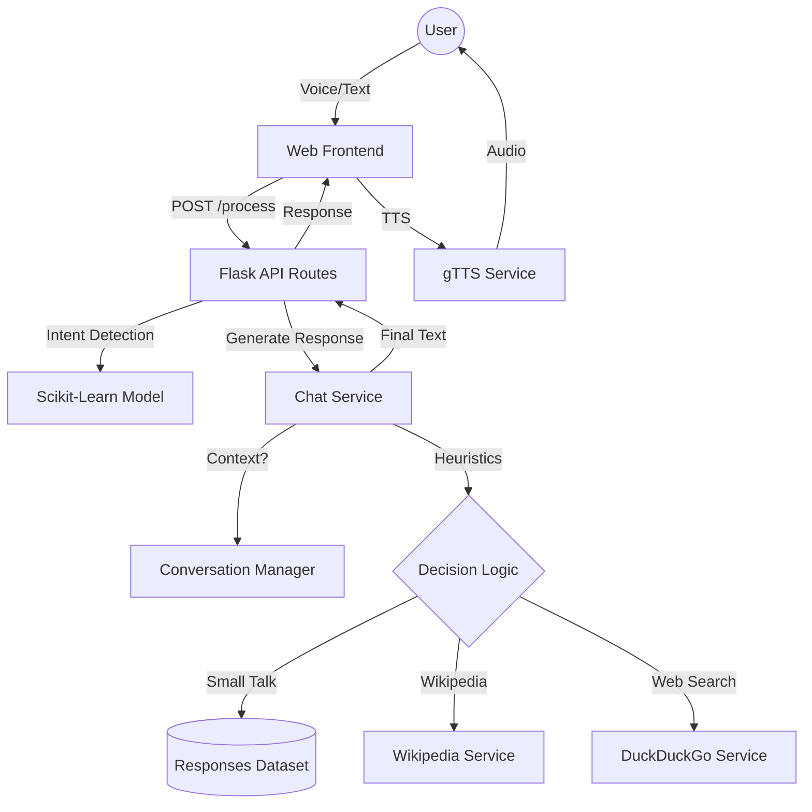

# Echo AI - Technical Documentation

Echo AI is a modular, high-performance voice-enabled AI assistant designed with a focus on natural conversation, context awareness, and real-time information retrieval.

## 1. System Architecture

Echo AI follows a modern client-server architecture with a clear separation of concerns.

### 1.1 Overview Flowchart



## 2. Backend Design (Modular Structure)

The backend is refactored into a modular package structure located in the `backend/` directory.

### 2.1 Core Components
- **`run.py`**: The entry point. Initializes the server, loads the ML model, and registers routes.
- **`app/__init__.py`**: Contains the `create_app` factory, configuring Flask and CORS.
- **`app/routes.py`**: Definiton of API endpoints (`/process`, `/tts`, `/health`, etc.).
- **`app/services/`**:
    - **`chat_service.py`**: The "brain". Handles intent prediction, context merging, and prioritization logic.
    - **`search_service.py`**: Integration layer for external knowledge APIs.

### 2.2 Response Generation Logic
The generation logic follows a strict priority queue to ensure the best user experience:
1. **Context Refinement**: Fragments (e.g., "in India") are merged with previous user messages.
2. **Identity Recognition**: "Who is..." or "What is..." triggers a specialized Wikipedia summary lookup.
3. **Small Talk Handling**: Greetings and thanks are handled by the local ML model to avoid unnecessary web latency.
4. **Informational Keyword Trigger**: Detection of words like `pm`, `capital`, or `weather` triggers real-time web search.
5. **Universal Fallback**: Any unhandled query with more than 2 words is sent to DuckDuckGo.

## 3. Frontend Implementation

The frontend is a responsive, dark-themed Single Page Application (SPA).

### 3.1 Key Features
- **Voice Recognition**: Uses the Web Speech API for real-time speech-to-text.
- **Micro-Animations**: CSS-driven animations for the "Listening" orb and message bubbles.
- **Dynamic Context**: Automatically sends a `session_id` to maintain conversation state across requests.

## 4. Operational Commands

### Starting the Server
```bash
python backend/run.py
```

### Running Tests
```bash
python backend/test_app_search.py
```

---
*Generated by Antigravity AI for Echo AI Project.*
